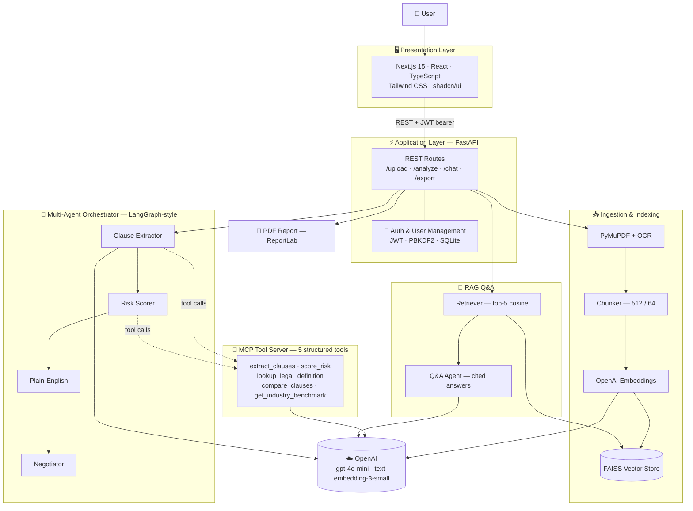
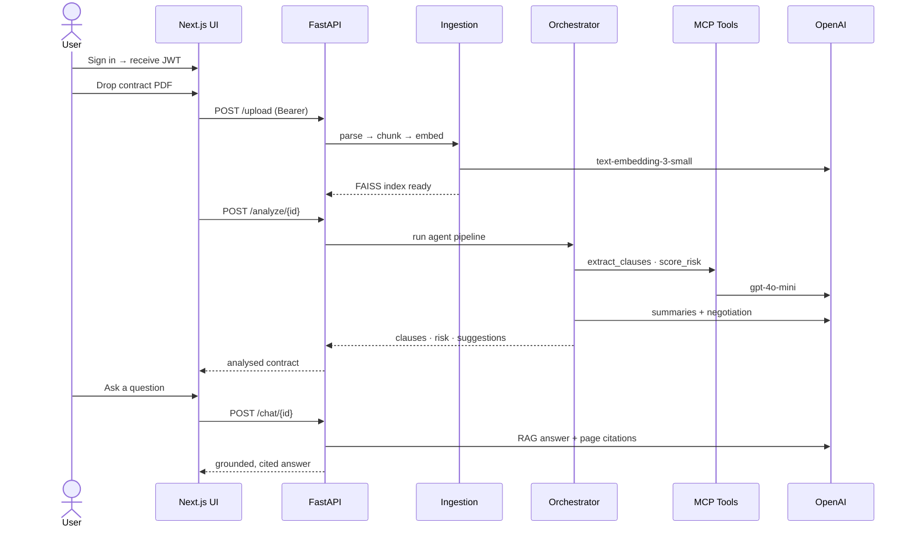

<div align="center">

# 🛡️ ContractIQ

### AI-Powered Contract Review & Risk Analyzer

Upload a legal contract and get back a structured risk report — clause-level risk
scores, plain-English summaries, negotiation suggestions, and an AI assistant that
answers questions grounded in the document with page citations.

Built on a **multi-agent AI pipeline**, a custom **MCP tool server**, and
**retrieval-augmented generation (RAG)**.

<br/>

<!-- ── Languages & Core ── -->


<!-- ── AI / RAG ── -->


<!-- ── Frontend ── -->


<!-- ── Platform ── -->


</div>

---

## 📖 Overview

ContractIQ ingests a contract PDF, analyses it with a chain of specialist AI
agents, and presents the results in a professional dashboard. It demonstrates a
modern, production-shaped AI stack end to end: **document ingestion → vector
retrieval → multi-agent reasoning → tool use (MCP) → grounded Q&A → reporting**,
wrapped in **JWT-secured** multi-user access.

> Implements the [ContractIQ SRS](ContractIQ_SRS.docx) — section / FR references
> in the code and this README map back to that specification.

---

## 🧰 Technology Stack

| Layer | Technologies |
|-------|--------------|
| **Frontend** | Next.js 15 (App Router) · React 18 · TypeScript · Tailwind CSS · shadcn/ui · Radix UI · lucide-react |
| **Backend / API** | Python 3.10+ · FastAPI · Pydantic v2 · Uvicorn |
| **AI & LLM** | OpenAI `gpt-4o-mini` (agents) · `text-embedding-3-small` (embeddings) · Anthropic Claude (optional) |
| **Agents & RAG** | LangGraph-style orchestrator · MCP tool server (`fastapi-mcp`) · FAISS vector store · LangChain text-splitters |
| **Ingestion** | PyMuPDF (PDF parsing) · pytesseract (OCR fallback) |
| **Reporting** | ReportLab (branded PDF export) |
| **Auth & Data** | PyJWT (JWT bearer) · PBKDF2-HMAC-SHA256 (password hashing) · SQLite (user store) |
| **Tooling / DevOps** | pytest · Docker · docker-compose |

---

## 🏗️ Architecture

A layered, four-tier design — Presentation → Application → Agents/Tools → Ingestion —
with a shared OpenAI backbone and JWT-secured, per-user contracts.



### Request flow — upload to insight



---

## ✨ Features

- **🔐 Auth & user management (FR-4.4)** — JWT sign-up / sign-in, PBKDF2 password
  hashing, per-user contract ownership, and an admin module to manage roles and accounts.
- **📥 Smart ingestion (FR-1)** — PyMuPDF extraction with OCR fallback, 512/64-token
  chunking, OpenAI embeddings, FAISS similarity index.
- **🤖 Multi-agent analysis (FR-2…FR-5)** — orchestrator runs *clause extractor →
  risk scorer → plain-English → negotiator* with per-node error isolation.
- **🧰 MCP tool server (FR-7)** — five structured tools (`extract_clauses`,
  `score_risk`, `lookup_legal_definition`, `compare_clauses`,
  `get_industry_benchmark`) exposed as a **real MCP server** at `/mcp` via
  [`fastapi-mcp`](https://github.com/tadata-org/fastapi_mcp) — schemas are
  auto-generated from the FastAPI endpoints, and the same tools are callable over plain REST.
- **🔎 Grounded RAG Q&A (FR-6)** — top-5 cosine retrieval, conversation memory,
  and answers that cite the exact page; declines when the answer isn't in the document.
- **📊 Professional dashboard (FR-8)** — shadcn/ui + Tailwind, light/dark mode,
  risk gauge, sortable clause table, side-by-side negotiation view, and live chat.
- **📄 PDF report export (FR-9)** — branded report via ReportLab (HTML fallback).
- **📈 Observability (FR-4.6)** — per-run latency and token traces at `/traces`.

---

## 🚀 Quick start

### 1 · Backend

```bash
python -m venv .venv && . .venv/Scripts/activate    # Windows
# source .venv/bin/activate                          # macOS / Linux
pip install -r requirements.txt
cp .env.example .env                                 # add your OPENAI_API_KEY
uvicorn contractiq.api.main:app --reload --port 8000
```

Visit http://localhost:8000/docs for the interactive API, or `/health` to confirm
the active provider/model (`llm_ready`, `embeddings_ready`).

### 2 · Frontend

```bash
cd frontend
npm install
cp .env.local.example .env.local
npm run dev            # http://localhost:3000
```

Open **http://localhost:3000** and sign up — **the first account becomes the admin.**

### 3 · Docker (both services)

```bash
docker compose up
```

---

## 🔌 API reference

| Method | Path | Purpose | SRS |
|--------|------|---------|-----|
| `POST` | `/auth/signup` · `/auth/login` | Register / sign in (returns JWT) | 4.4 |
| `GET` | `/auth/me` | Current user | 4.4 |
| `GET` `PATCH` `DELETE` | `/users` · `/users/{id}` | Admin user management | 4.4 |
| `POST` | `/upload` | Upload + ingest a PDF *(auth)* | FR-1 |
| `POST` | `/analyze/{id}` | Run the multi-agent pipeline | FR-2…FR-5 |
| `GET` | `/contracts` · `/contract/{id}` | List / fetch analysed contracts | 5.1 |
| `POST` | `/chat/{id}` | Ask a question (RAG) | FR-6 |
| `GET` | `/export/{id}` | Download PDF report | FR-9 |
| `POST` | `/tools/{name}` | Call a tool over REST (5 FR-7 tools) | FR-7 |
| — | `/mcp` | **Real MCP server** (Streamable HTTP, via `fastapi-mcp`) | FR-7 |
| `GET` | `/traces` | Latency + token traces | 4.6 |

---

## 🔑 Configuration

All settings are environment variables (see [`.env.example`](.env.example)).
`OPENAI_API_KEY` is **required** — there is no mock mode; calls without a key fail
fast with a clear message.

| Variable | Default | Notes |
|----------|---------|-------|
| `OPENAI_API_KEY` | — | **Required** — embeddings + `gpt-4o-mini` agents |
| `LLM_PROVIDER` | `auto` | `auto` \| `openai` \| `anthropic` |
| `OPENAI_CHAT_MODEL` | `gpt-4o-mini` | bump to `gpt-4o` for the highest-quality analysis |
| `JWT_SECRET` | dev value | **set a strong secret in production** |
| `SIMILARITY_THRESHOLD` | `0.2` | RAG relevance floor (tuned for `text-embedding-3-small`) |
| `VECTOR_STORE` | `faiss` | `faiss` \| `chroma` \| `memory` |
| `MAX_UPLOAD_MB` | `50` | Upload size limit |

---

## 🧪 Tests & evaluation

```bash
pytest                           # unit + integration (ingestion → agents → auth → API)
python -m evals.eval_retrieval   # precision@5, citation & risk-band accuracy
```

The suite uses deterministic **test doubles** so it runs offline and free; set
`CONTRACTIQ_LIVE_TESTS=1` to exercise the real providers. The eval harness loads
labelled contracts from `evals/test_contracts/`.

---

## 🧩 MCP server

The five FR-7 tools are defined once as FastAPI endpoints
([`mcp_server/router.py`](contractiq/mcp_server/router.py)) and turned into a real
**MCP server** at `/mcp` by [`fastapi-mcp`](https://github.com/tadata-org/fastapi_mcp)
— no hand-written transport or JSON schemas. Tool schemas are generated from the
endpoints' Pydantic models, so they can never drift from the implementation.

Point any MCP host at the running server (see [`mcp.config.example.json`](mcp.config.example.json));
for stdio-only hosts like Claude Desktop, bridge with `mcp-remote`:

```jsonc
// claude_desktop_config.json
{ "mcpServers": { "contractiq": {
  "command": "npx", "args": ["-y", "mcp-remote", "http://localhost:8000/mcp"] } } }
```

Verified with a live MCP client: `initialize` → `list_tools` (5 tools) → `call_tool`.

---

## 📂 Project structure

```text
contractiq/
├── core/         config · models · OpenAI LLM + embeddings · FAISS · taxonomy
├── ingestion/    PyMuPDF parser · chunker · embedder            (FR-1)
├── rag/          retriever · Q&A agent                          (FR-6)
├── mcp_server/   5 tool fns + REST router → MCP via fastapi-mcp  (FR-7)
├── agents/       orchestrator + 4 specialist agents             (FR-2…FR-5)
├── auth/         JWT · PBKDF2 · SQLite user store + admin        (FR-4.4)
├── api/          FastAPI app + routes
├── report/       ReportLab PDF generator                        (FR-9)
└── service.py    per-user session orchestration
frontend/         Next.js + Tailwind + shadcn/ui dashboard       (FR-8)
evals/            eval_retrieval (.py / .ipynb) + labelled contracts
tests/            pytest suite
docker-compose.yml · Dockerfile · .env.example
```

---

## 🗺️ Roadmap

- Multi-page real-world PDFs with per-clause page citations at scale
- Grow the evaluation set toward the 20-contract SRS acceptance target
- Persistent contract storage (currently ephemeral, in-memory per SRS 4.4)
- Streaming chat responses and richer report theming

---

<div align="center">

Built as a portfolio showcase of an end-to-end, production-shaped AI engineering stack —
**RAG · multi-agent orchestration · MCP tool use · JWT auth · modern React UI.**

</div>
